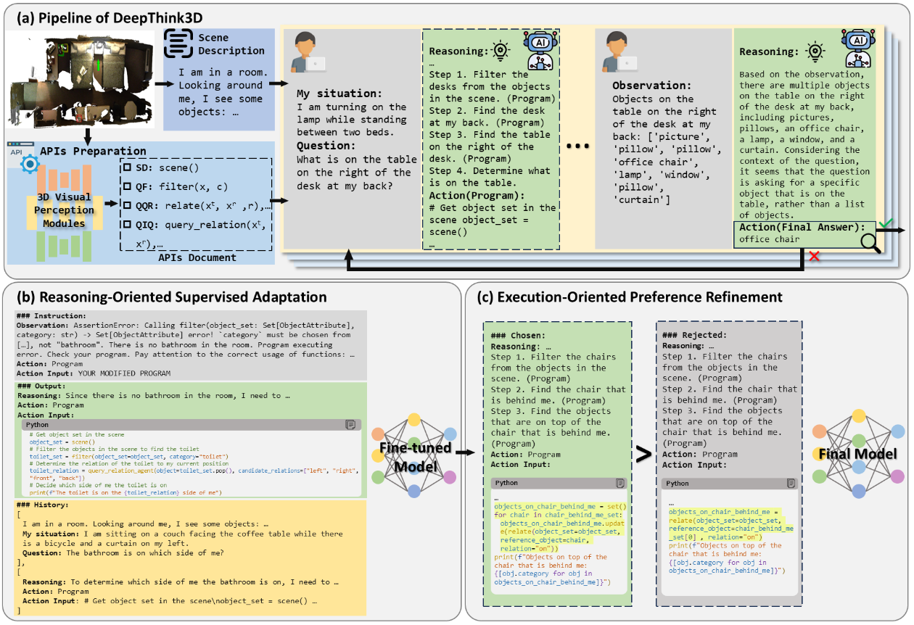

# DeepThink3D

Official implementation for the paper "DeepThink3D: Enhancing Large Language Models
with Programmatic Reasoning in Complex 3D Situated
Reasoning Tasks"



## Environment Setup

We have tested the code on Ubuntu 20.04 with Python 3.9, PyTorch 2.6.0, CUDA 12.2.
```bash
pip install -r requirements.txt
pip install dgl-cu113 -f https://data.dgl.ai/wheels/repo.html
```

## Prepare Data

### LLM

We use OpenAI-Compatible API as LLM service, you can modify your LLM setting in `run/scripts/llm-tpc/config.json`. Different states can use different LLMs. Please pay attention to the settings.

### Scene Dataset

To acquire the access to ScanNet dataset, please refer to [ScanNet](https://github.com/ScanNet/ScanNet) and follow the instructions there. You will get a download-scannet.py script after your request for the ScanNet dataset is approved. Use the commands below to download the portion of ScanNet that is necessary for LLM-TPC:

```
python download-scannet.py -o data --type _vh_clean_2.0.010000.segs.json
python download-scannet.py -o data --type _vh_clean_2.labels.ply
python download-scannet.py -o data --type _vh_clean_2.ply
python download-scannet.py -o data --type .aggregation.json
python download-scannet.py -o data --type .txt
```

### QA Dataset

Please refer to [SQA3D](https://github.com/SilongYong/SQA3D) for the QA dataset. SQA3D data is hosted [here](https://zenodo.org/records/7792397#.ZCkprfFBx3g). Our new train QA has been put in `data/qa/SQA_new_train.json`.


### OpenShape
We use the [pointbert-vitg14-rgb](https://huggingface.co/OpenShape/openshape-pointbert-vitg14-rgb/tree/main) and [OpenCLIP ViT-bigG-14](https://huggingface.co/laion/CLIP-ViT-bigG-14-laion2B-39B-b160k/tree/main) checkpoint from [OpenShape](https://github.com/Colin97/OpenShape_code).
Download `model.pt` from [here](https://huggingface.co/OpenShape/openshape-pointbert-vitg14-rgb/tree/main) and `open_clip_pytorch_model.bin` from [here](https://huggingface.co/laion/CLIP-ViT-bigG-14-laion2B-39B-b160k/tree/main). Put them under `data/openshape`.


### Layout

Please arrange all prepared data as follows:

```
run/data
├── openshape
│   ├── model.pt
│   └── open_clip_pytorch_model.bin
├── qa
│   ├── SQA_test.json
│   ├── SQA_new_train.json
│   └── SQA_train.json
├── scans
│   ├── scene0000_00
│   │   ├── scene0000_00_vh_clean_2.0.010000.segs.json
│   │   ├── scene0000_00_vh_clean_2.labels.ply
│   │   ├── scene0000_00_vh_clean_2.ply
│   │   ├── scene0000_00.aggregation.json
│   │   └── scene0000_00.txt
│   └── ...
└── scannetv2-labels.combined.tsv
```

## Run

You can run the code with the following command:

```bash
# Inference
cd run/scripts

# Single scene
CUDA_VISIBLE_DEVICES=$CUDA_VISIBLE_DEVICES python example.py --agent llm-tpc/config.json
# Multiple scenes
# split is a list of question ids you want to run
# modify qa_file and split in config.json to specify train or test set
CUDA_VISIBLE_DEVICES=$CUDA_VISIBLE_DEVICES python example_all_split.py --agent llm-tpc/config.json --split ../split/test_split_all


# Evaluation
cd run/scripts

python eval.py --log_dir ../logs/test/llm-tpc


# Visualization
cd run/src/dataset

python visualize_bbox.py # you can choose which object to visualize, please refer to `visualize_bbox.py` for more details
```

## Train
We use [LLaMA-Factory](https://github.com/hiyouga/LLaMA-Factory) as the platform for training. SFT and DPO data are stored in `train/train_data.zip`, you should add dataset info to `LLaMA-Factory/data/dataset_info.json`. Besides, you can generate your own data by running `run/scripts/sft_data_build.py` and `run/scripts/dpo_data_build.py` with specified log directory.

```
cd train
unzip train_data.zip
cd ..

# modify dataset info
{
    "DeepThink3D_SFT_data": {
    "file_name": "/PATH_TO_YOUR_REPO/train/DeepThink3D_SFT_data.json",
    "columns": {
      "prompt": "instruction",
      "response": "output",
      "system": "system",
      "history": "history"
    }
  },
  "DeepThink3D_DPO_data": {
    "file_name": "/PATH_TO_YOUR_REPO/train/DeepThink3D_DPO_data.json",
    "formatting": "sharegpt",
    "ranking": true,
    "columns": {
      "messages": "conversations",
      "chosen": "chosen",
      "rejected": "rejected"
    }
  },
  ...
}
```

After Install LLaMA-Factory, you can run the following command to train and use the model:

```
CUDA_VISIBLE_DEVICES=${CUDA_VISIBLE_DEVICES} API_PORT=${API_PORT} llamafactory-cli train train/SFT_traing_config.yaml
CUDA_VISIBLE_DEVICES=${CUDA_VISIBLE_DEVICES} API_PORT=${API_PORT} llamafactory-cli train train/DPO_traing_config.yaml
CUDA_VISIBLE_DEVICES=${CUDA_VISIBLE_DEVICES} API_PORT=${API_PORT} llamafactory-cli api train/llm.yaml
```


## Acknowledgement
- [LLM-TPC](https://github.com/QingrongH/LLM-TPC): Inference codes we build upon.
- [LLaMA-Factory](https://github.com/hiyouga/LLaMA-Factory): Training platform.
